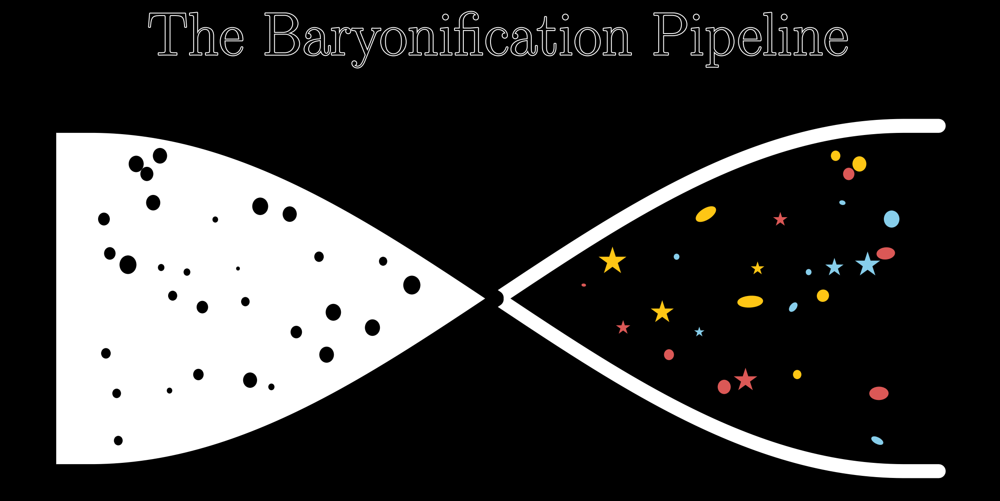

The Baryonification pipeline
===================================

**Baryonification** is a pipeline for *Baryonifying* N-body simulations, by adding baryon-induced corrections to the density field 
and/or adding thermodynamic fields such as the gas pressure, temperature etc. The entire modelling pipeline is built out 
of the Core Cosmology Library (CCL).

.. toctree::
   :maxdepth: 2
   :caption: Contents:

   modules

Indices and tables
==================

* :ref:`genindex`
* :ref:`modindex`
* :ref:`search`